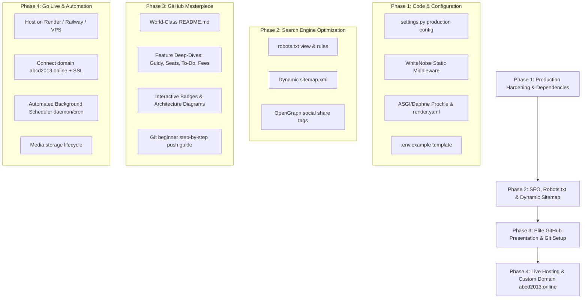

# 🚀 Project Launch, Elite GitHub Showcase & Production Deployment Master Plan

## Overview
This master plan guides the end-to-end transformation of the **ABCD Coaching & Library Management Platform** from a local development project into a production-hardened web application, hosted online under your custom domain (**`abcd2013.online`**), and presented on GitHub with an industry-grade, visually stunning repository.

---

## 🎯 Executive Assessment: Is Your Project Ready to Host?

> [!NOTE]
> **Good News:** Your Django application passed all system checks (`System check identified no issues (0 silenced)`). The core logic, models, views, and database migrations are fully functional!
> 
> **What is needed before pushing to GitHub and going live:**
> 1. **Production Settings & Security Hardening:** Making `ALLOWED_HOSTS`, `CSRF_TRUSTED_ORIGINS`, `DEBUG`, `SECRET_KEY`, and `DATABASES` environment-variable driven so production runs safely on HTTPS and PostgreSQL/SQLite without exposing sensitive credentials.
> 2. **Static Asset Serving (WhiteNoise):** Enabling WhiteNoise so stylesheets, JavaScript, logos, and fonts render automatically in production.
> 3. **ASGI / WebSockets Daphne Configuration:** Ensuring Daphne runs the ASGI server in production so **Guidy Real-Time Chat** and live notifications work seamlessly.
> 4. **SEO & Indexing:** Adding `robots.txt`, dynamic `sitemap.xml`, and OpenGraph metadata.
> 5. **Git & GitHub Sanitization:** Creating `.env.example`, verifying `.gitignore` to prevent any database or secret leaks, and structuring a top-tier GitHub README.

---

## 🗺️ The 4-Phase Master Roadmap



---

## 🛠️ Proposed Changes

### Phase 1: Production Hardening & Configuration

#### [MODIFY] [settings.py](file:///b:/ABCD/abcd_web/abcd_web/settings.py)
- **Environment Driven Settings:**
  - `SECRET_KEY = config('SECRET_KEY')`
  - `DEBUG = config('DEBUG', default=False, cast=bool)`
  - `ALLOWED_HOSTS = config('ALLOWED_HOSTS', default='127.0.0.1,localhost,abcd2013.online,www.abcd2013.online').split(',')`
  - `CSRF_TRUSTED_ORIGINS = config('CSRF_TRUSTED_ORIGINS', default='https://abcd2013.online,https://www.abcd2013.online,http://127.0.0.1:8000').split(',')`
- **Dynamic Database Configuration:**
  - Support PostgreSQL in production via `dj_database_url.config()` with fallback to local SQLite for development.
- **Static Assets & WhiteNoise:**
  - Add `'whitenoise.runserver_nostatic'` to `INSTALLED_APPS` (before staticfiles).
  - Add `'whitenoise.middleware.WhiteNoiseMiddleware'` to `MIDDLEWARE`.
  - Configure `STORAGES` / `STATICFILES_STORAGE = 'whitenoise.storage.CompressedManifestStaticFilesStorage'`.
- **Production Security Headers (Active when `DEBUG=False`):**
  - `SECURE_BROWSER_XSS_FILTER = True`
  - `SECURE_CONTENT_TYPE_NOSNIFF = True`
  - `SESSION_COOKIE_SECURE = True`
  - `CSRF_COOKIE_SECURE = True`
  - `X_FRAME_OPTIONS = 'SAMEORIGIN'`

#### [MODIFY] [requirements.txt](file:///b:/ABCD/abcd_web/requirements.txt)
- Ensure all essential production libraries are recorded:
  - `whitenoise>=6.8.0`
  - `dj-database-url>=2.3.0`
  - `psycopg2-binary>=2.9.10`
  - `gunicorn>=23.0.0`
  - `uvicorn[standard]>=0.34.0`

#### [NEW] [.env.example](file:///b:/ABCD/abcd_web/.env.example)
- Clean, thoroughly commented template of all required environment variables with dummy values, explaining each setting (Django core, SMTP Email, Google OAuth, Meta WhatsApp API, SMS Gateway, YouTube API, VAPID Web Push).

#### [NEW] [Procfile](file:///b:/ABCD/abcd_web/Procfile)
- Specifies the ASGI web server command to serve both HTTP and WebSockets via Daphne:
  ```procfile
  web: daphne -b 0.0.0.0 -p $PORT abcd_web.asgi:application
  worker: python manage.py run_local_scheduler
  ```

#### [NEW] [render.yaml](file:///b:/ABCD/abcd_web/render.yaml)
- Blueprint for 1-click deployment on Render with build commands:
  `pip install -r requirements.txt && python manage.py collectstatic --noinput && python manage.py migrate`

---

### Phase 2: SEO, Sitemap & Robots.txt

#### [MODIFY] [urls.py](file:///b:/ABCD/abcd_web/users/urls.py) and [views.py](file:///b:/ABCD/abcd_web/users/views.py)
- **`robots.txt`**: Serves crawler rules allowing search engines (Google, Bing) to index public landing pages (`/`, `/about/`, `/services/`, `/courses/`, `/admission-form/`, `/library-availability/`, `/hall-of-fame/`) while shielding authenticated dashboards (`/teacher/`, `/dashboard/`, `/todo/`, `/guidy/`, `/admin/`, `/api/`).
- **`sitemap.xml`**: Dynamic XML sitemap listing all public static pages and dynamic active course detail pages with `changefreq` and `priority`.

---

### Phase 3: Elite GitHub Presentation & Beginner Git Guide

#### [NEW] [README.md](file:///b:/ABCD/README.md)
A high-converting, visual repository presentation containing:
1. **Hero Header & Badges:** Tech stack badges (Python 3.12, Django 5.2, Channels, Daphne, SQLite/PostgreSQL, Bootstrap, Vanilla JS).
2. **Live Demo Banner:** Direct link to `https://abcd2013.online`.
3. **Core Feature Showcase (with UI mockups & flows):**
   - 🎓 **Guidy Real-Time Mentorship Engine**: 1-to-1 direct messaging, student-to-alumni guidance channels, group chats, message pinning, starring, search, 10-day media auto-purge.
   - 🪑 **Smart Library Seating Allocation Matrix**: Visual SVG seating grid, real-time vacant/occupied/reserved/on-hold states, 3-day grace hold period, automated waitlist promotions, seat switch request workflows.
   - 📝 **To-Do Hub (Isolated Productivity Buffer)**: Student-linked task tracking, auto-trash recycling lifecycle, fee reminder integration.
   - 🧾 **Fees Accounting & Smart PDF Receipt Generator**: Visual monthly fee calendar matrix, instant PDF receipt generation with seal and signature, automated WhatsApp & Email overdue reminders.
   - 🎥 **YouTube Course Sync & Community Q&A**: Direct playlist sync, study materials download tracking, community Q&A with upvoting.
   - 📢 **Omnichannel Broadcast Dispatcher**: Push notifications (VAPID), Email (SMTP), Meta WhatsApp Cloud API, and SMS.
   - 🏆 **Hall of Fame & Alumni Network**: Verified exam achievements, teacher approval pipeline.
   - 🛠️ **Public Grievance Redressal System**: Student complaint filing with photo evidence, public resolved showcase, satisfaction rating system.
4. **Architecture Diagrams (Mermaid):**
   - Real-time ASGI WebSocket Flow (Daphne -> Channels -> GuidyChatConsumer).
   - Automated Background Daemon Architecture (`run_local_scheduler.py`).
5. **Local Installation & Developer Setup Guide:**
   - Clone, virtual environment creation, pip install, migrate, runserver, and run_local_scheduler.

---

### Phase 4: Production Deployment & Domain Linking Roadmap

1. **Hosting Platform Selection:**
   - **Render / Railway (PaaS - Recommended for Ease):** Zero server management, free SSL, auto-deploy on `git push main`, managed PostgreSQL database.
   - **VPS (DigitalOcean / Hetzner / AWS EC2):** Full control with Nginx + Daphne + Systemd + Certbot SSL.
2. **Custom Domain (`abcd2013.online`) DNS Setup:**
   - Add **CNAME** and **A** records pointing to your hosting provider.
   - Automatic SSL certificate generation (Let's Encrypt HTTPS).
3. **Automated Background Scheduler Execution:**
   - Run `python manage.py run_local_scheduler` as a dedicated background worker, OR trigger `python manage.py run_local_scheduler --once` via scheduled cron jobs (e.g. cron-job.org / Render cron).
4. **Media Uploads Strategy:**
   - Persistent volume on host OR free cloud storage tier (Cloudinary / Supabase Storage) for user profile photos and complaint images.

---

## 🔍 Verification Plan

### Automated Checks
- Run `python manage.py check` to verify zero settings or syntax errors.
- Run `python manage.py collectstatic --noinput --dry-run` to test WhiteNoise static collection.
- Test `robots.txt` and `sitemap.xml` URL responses.

### Security Audit (Snyk & Git)
- Run `snyk_code_scan` to verify zero security vulnerabilities in newly modified code.
- Verify `.gitignore` rules ensure `.env` and `db.sqlite3` are strictly uncommitted.

---

## ❓ Open Questions & Choices for You

> [!IMPORTANT]
> 1. **Preferred Hosting Destination:**
>    - **Option A (Render.com - Recommended):** Simplest setup, free tier available, automatic HTTPS, seamless Git integration.
>    - **Option B (Railway.app):** Excellent performance, native Redis/Postgres addons, low friction.
>    - **Option C (VPS / Linux Server):** Complete freedom, lowest long-term cost, handles SQLite or Postgres easily.
>
> 2. **GitHub Repository Name:**
>    - Proposed: `abcd-coaching-library-management-system` or `abcd-web-platform`. Do you have a specific name in mind?
