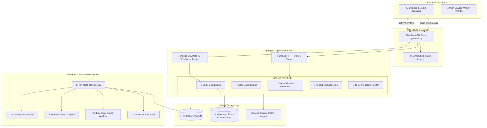

<div align="center">

# 🏛️ ABCD Coaching & Smart Library Management Platform
### *An Enterprise-Grade, Real-Time Educational ERP & Digital Library Ecosystem*

[](https://abcd2013.online)
[](https://python.org)
[](https://djangoproject.com)
[](https://channels.readthedocs.io)
[](https://github.com/django/daphne)
[](https://postgresql.org)
[](https://developers.facebook.com/docs/whatsapp)
[](LICENSE)

<br/>

<p align="center">
  <b>A comprehensive, state-of-the-art Web application engineered for modern educational institutes and 24/7 digital libraries.</b><br/>
  Featuring real-time mentorship chat, interactive visual seating allocation, automated accounting with PDF receipts, omnichannel notifications, YouTube playlist course synchronization, and autonomous background maintenance daemons.
</p>

[Explore Features](#-key-architectural-modules) • [Live Demo](#-live-deployment) • [Architecture](#-system-architecture) • [Quick Start](#-getting-started) • [Deployment](#-production-deployment)

---

</div>

## 🌟 Highlights & Achievements
- ⏱️ **1 Year of Continuous Engineering:** Built from the ground up with robust Django architecture, scalable ASGI WebSockets, and modular services.
- ⚡ **Real-Time Communication:** Sub-second latency messaging and instant push alerts powered by Django Channels and Daphne.
- 🪑 **Visual Seating Matrix:** Real-time interactive seat grid with 3-day grace hold period automations and instant switch workflows.
- 🧾 **Financially Audited:** Automated fee lifecycle tracker with cryptographic PDF receipt generator and digital verification.
- 📱 **Omnichannel Outreach:** Native multi-channel broadcasting via Web Push (VAPID), Meta WhatsApp Cloud API, SMTP Email, and SMS.

---

## 🚀 Key Architectural Modules

### 1. 🎓 Guidy: Real-Time Mentorship & Communication Engine
*A private, high-performance messaging platform connecting students, teachers, and alumni.*
- **Triple-Channel Communication:** Supports **1-to-1 Direct Chats**, **Student-to-Alumni Guidance Channels**, and **Moderated Group Discussions**.
- **WebSocket Driven:** Instant message delivery, online presence tracking, and live typing indicators with zero-polling overhead.
- **Smart Message Controls:** Search message history, pin important announcements, star favorite messages, and block abusive users.
- **Self-Cleaning Media Lifecycle:** Automated background purger that automatically recycles expired chat media after 10 days and prunes deleted group rooms after 30 days to optimize disk usage.

### 2. 🪑 Smart Library Seating Allocation & Reservation Matrix
*An interactive visual floor plan eliminating manual seat booking confusion.*
- **Interactive SVG Seating Grid:** Real-time color-coded seat visualization (Available, Occupied, Reserved, On-Hold, Locked).
- **Shift Management:** Multi-shift support (Morning, Afternoon, Evening, Full Day) with separate occupancy tracking.
- **3-Day Grace Hold & Auto-Promotions:** Automated waitlist engine that holds seats during renewal grace periods and automatically promotes waitlisted applicants.
- **Teacher Control Panel:** Instant seat locking, manual student assignments, and one-click seat switch approval/rejection pipelines.

### 3. 📝 To-Do Hub & Isolated Productivity Buffer
*A specialized productivity workflow designed for teachers and administrators.*
- **Contextual Student Linking:** Attach tasks directly to specific student profiles or fee records.
- **Sub-task Breakdowns & Progress Meter:** Create granular checklists with completion percentages.
- **Auto-Trash Lifecycle:** High-frequency automation daemon that recycles completed and discarded items without cluttering core databases.

### 4. 🧾 Fees Accounting & Smart PDF Receipt Generator
*An automated, transparent accounting engine for tuition and library fees.*
- **Visual Monthly Calendar Matrix:** 12-month interactive grid per student reflecting paid, pending, and overdue statuses.
- **Instant PDF Receipt Generation:** Produces downloadable, print-ready PDF receipts complete with official institute seal, authorized signature, and unique transaction hashes.
- **Automated Overdue Warnings:** Dispatches polite payment reminders and overdue alerts via WhatsApp and Email before seat revocation.

### 5. 🎥 YouTube Course Sync & Interactive Community Q&A
*A rich learning management system (LMS) integrated directly with YouTube Data API v3.*
- **Playlist Sync Wizard:** Automatically imports playlists, video metadata, and thumbnails into organized course modules.
- **Dual-Tier Study Materials:** Upload PDF notes and lecture materials with privacy controls (Public vs Enrolled-Only).
- **Community Q&A Board:** Threaded discussion forum with upvotes, teacher verified answers, and student learning reminders.

### 6. 📢 Omnichannel Broadcast Dispatcher
*Unified broadcast command center for emergency alerts and general notices.*
- **Web Push Notifications:** Native browser push notifications powered by VAPID Service Workers.
- **Meta WhatsApp Cloud API:** Dispatches structured WhatsApp templates directly to parents and students.
- **Email & SMS:** Automated failover to SMTP Email and SMS gateways.
- **Dismissible Announcement Banners:** Broadcasts flash banners across student and teacher dashboards.

### 7. 🏆 Hall of Fame & Alumni Network
*Public celebration of student success and competitive exam selections.*
- **Achievement Submissions:** Students submit exam selections (UPSC, SSC, State PSC, Banking) with scorecards.
- **Moderation Workflow:** Staff review and verified badge attribution before public publication on the Hall of Fame.

### 8. 🛠️ Public Grievance & Complaint Redressal Portal
*End-to-end transparency for facility issues and maintenance.*
- **Photo Evidence Uploads:** Students log maintenance issues (Wi-Fi, AC, lighting, cleanliness) with photos.
- **Public Resolution Gallery:** Displays resolved complaints with before/after status to build trust.
- **Student Satisfaction Rating:** Students rate the resolution quality after completion.

---

## 🏗️ System Architecture



---

## 🛠️ Tech Stack & Integrations

| Layer | Technologies |
| :--- | :--- |
| **Backend Framework** | [Django 5.2](https://www.djangoproject.com/) (Python 3.12+) |
| **Real-Time WebSockets** | [Django Channels 4.3](https://channels.readthedocs.io/), [Daphne ASGI](https://github.com/django/daphne), [Twisted](https://twisted.org/) |
| **Database** | [PostgreSQL](https://www.postgresql.org/) (Production via `dj-database-url`) / [SQLite3](https://www.sqlite.org/) (Dev) |
| **Static Files Serving** | [WhiteNoise 6.12](https://whitenoise.readthedocs.io/) (Compressed Manifest Storage) |
| **Frontend & UI** | Semantic HTML5, Vanilla JavaScript (ES6+), Modern CSS3, SVG Visualizers, Bootstrap 5 |
| **PDF Generation** | [ReportLab](https://www.reportlab.com/) & [PyPDF](https://pypdf.readthedocs.io/) |
| **Authentication** | Django Auth + [Google OAuth2](https://developers.google.com/identity) (`social-auth-app-django`) + OTP 2FA |
| **Push Notifications** | [PyWebPush](https://github.com/web-push-libs/pywebpush) (VAPID Protocol + Service Workers) |
| **External APIs** | [Meta WhatsApp Business Cloud API](https://developers.facebook.com/docs/whatsapp), [YouTube Data API v3](https://developers.google.com/youtube/v3), Gmail SMTP |

---

## 🚀 Getting Started

### Prerequisites
- **Python 3.10+** (Python 3.12 recommended)
- **Git** installed on your system
- **Virtualenv** (`python -m venv`)

### 1. Clone the Repository
```bash
git clone https://github.com/Vikas003dangi/abcd-web-platform.git
cd abcd-web-platform/abcd_web
```

### 2. Set Up Virtual Environment
```bash
# Windows
python -m venv venv
venv\Scripts\activate

# Linux / macOS
python3 -m venv venv
source venv/bin/activate
```

### 3. Install Dependencies
```bash
pip install -r requirements.txt
```

### 4. Configure Environment Variables
Copy `.env.example` to `.env` and fill in your credentials:
```bash
cp .env.example .env
```

### 5. Run Migrations & Collect Static Files
```bash
python manage.py migrate
python manage.py collectstatic --noinput
```

### 6. Start Development Servers
In **Terminal 1** (Web & WebSocket Server):
```bash
python manage.py runserver
```

In **Terminal 2** (Real-Time Background Automation Daemon):
```bash
python manage.py run_local_scheduler
```

Open `http://127.0.0.1:8000` in your browser to experience the platform!

---

## 🌐 Production Deployment

### Option A: 1-Click Deploy on Render (Recommended)
1. Push your repository to **GitHub**.
2. Sign in to [Render.com](https://render.com) and click **New > Blueprint**.
3. Connect your GitHub repository — Render will automatically read `render.yaml`, provision a PostgreSQL database, run static asset compilation, and boot Daphne ASGI!

### Option B: Procfile Support (Railway, Heroku, Fly.io)
The repository includes a production-ready `Procfile`:
```procfile
web: daphne -b 0.0.0.0 -p $PORT abcd_web.asgi:application
worker: python manage.py run_local_scheduler
```

### Option C: Custom Domain & DNS (`abcd2013.online`)
To point your custom domain:
1. In your domain registrar DNS settings (GoDaddy, Namecheap, Cloudflare), add:
   - **CNAME Record:** `www` pointing to your deployment URL (e.g., `abcd-web-platform.onrender.com`).
   - **A Record:** `@` pointing to your host's IP address.
2. Ensure `ALLOWED_HOSTS` and `CSRF_TRUSTED_ORIGINS` include `abcd2013.online`.

---

## 📁 Repository Structure

```
ABCD/
├── .env.example                 # Production environment variable template
├── .gitignore                   # Comprehensive exclusion rules (zero secret leaks)
├── Procfile                     # Process definitions for Daphne ASGI web + worker
├── render.yaml                  # Infrastructure-as-code deployment blueprint
├── README.md                    # Project documentation & showcase
│
└── abcd_web/
    ├── manage.py                # Django CLI management entry point
    ├── requirements.txt         # Production-locked dependencies
    │
    ├── abcd_web/                # Django Project Core
    │   ├── asgi.py              # ASGI WebSockets application configuration
    │   ├── settings.py          # Hardened production settings
    │   ├── urls.py              # Root routing (Admin, Favicon, SEO robots/sitemap)
    │   └── wsgi.py              # WSGI legacy fallback
    │
    ├── users/                   # Main Application App
    │   ├── consumers.py         # WebSockets consumers for Guidy Chat & Push
    │   ├── models.py            # Data models (Students, Seats, Fees, Courses, etc.)
    │   ├── views.py             # Business controllers & API endpoints
    │   ├── forms.py             # Form validation & sanitation
    │   ├── notifications.py     # Multi-channel notification dispatcher
    │   ├── email_service.py     # HTML email rendering engine
    │   ├── youtube_service.py   # YouTube API playlist integration
    │   │
    │   ├── management/commands/ # Background Management Daemons
    │   │   ├── run_local_scheduler.py   # Centralized Background Daemon
    │   │   ├── send_fee_reminders.py    # Fee expiry & warning dispatcher
    │   │   ├── process_seat_reminders.py# 3-day hold & promotion manager
    │   │   ├── process_todo.py          # To-Do auto-trash lifecycle
    │   │   └── cleanup_broadcasts.py    # Media & broadcast purger
    │   │
    │   ├── templates/users/     # Responsive HTML5 Templates (39 screens)
    │   └── static/              # Compiled CSS, JavaScript & Media Assets
    │       ├── css/             # Custom responsive styling & seat layout
    │       └── js/              # Interactive seat matrix, tour, and WebPush
```

---

## 🔒 Security & Privacy Practices
- **Zero Hardcoded Secrets:** All credentials, private keys, database connections, and API tokens are dynamically loaded via environment variables.
- **CSRF & XSS Protection:** Strict CSRF origin enforcement, clickjacking defense (`X-Frame-Options: SAMEORIGIN`), and Content Security policies.
- **Automated Media Cleanup:** Ephemeral media lifecycles ensure confidential student communications and grievance images are automatically sanitized.

---

## 👥 Authors & Acknowledgements
- **Lead Developer & Architect:** Vikas
- **Institution:** ABCD Coaching & Library ([abcd2013.online](https://abcd2013.online))
- **Dedicated Mentorship:** Sandeep Sir & the ABCD Coaching Faculty

---

<div align="center">
  <b>Built with ❤️ and engineered for excellence.</b>
</div>
