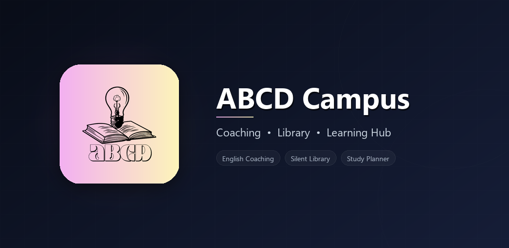
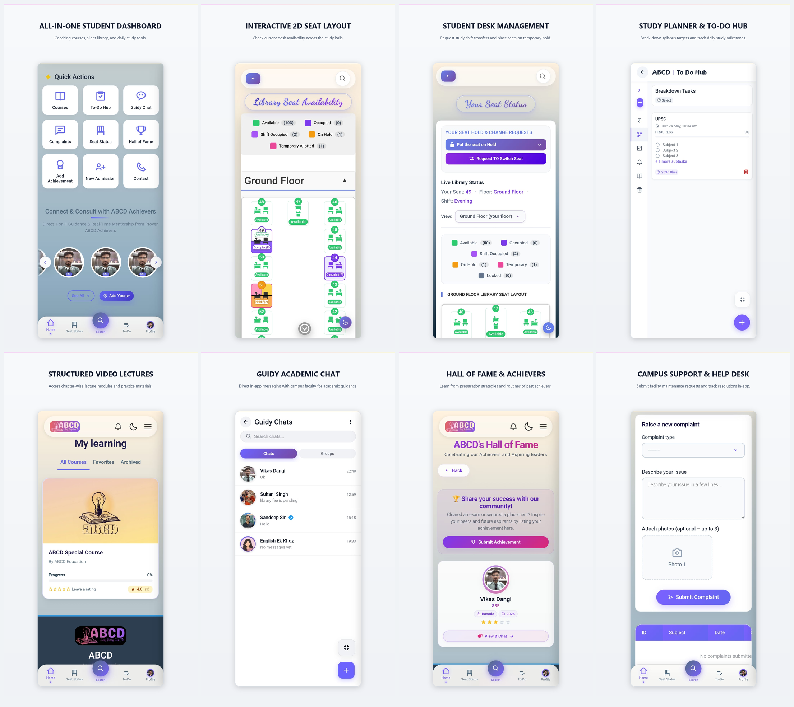
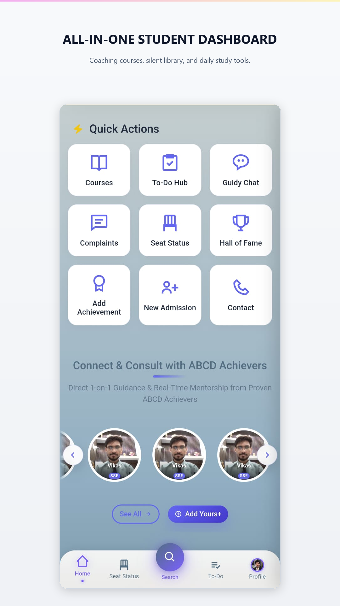
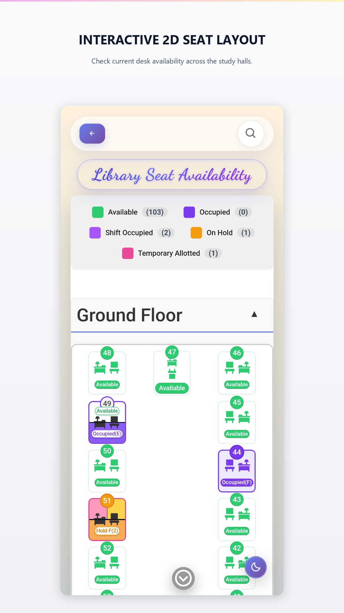
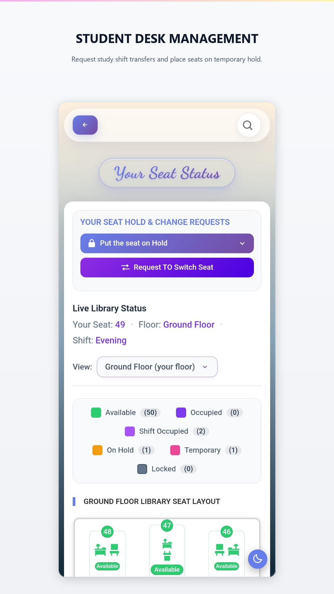
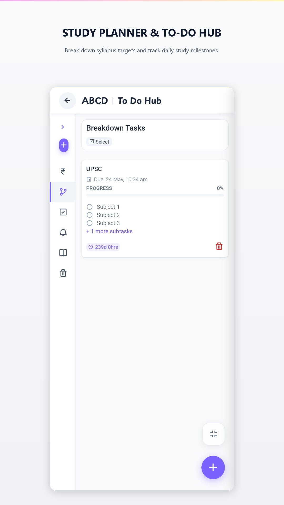
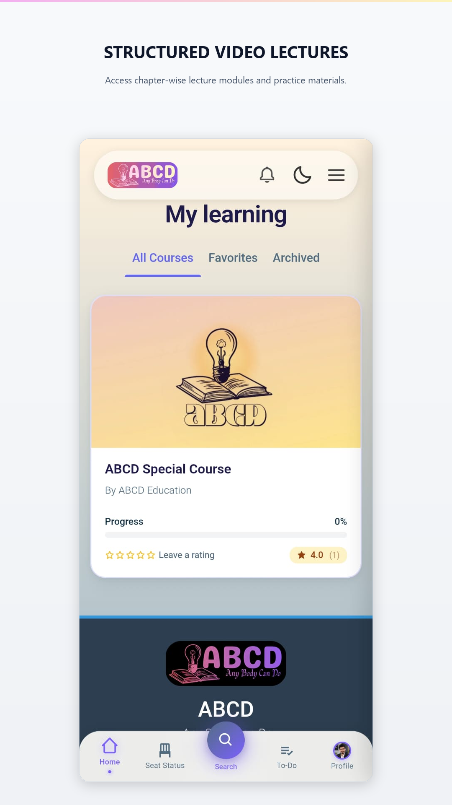
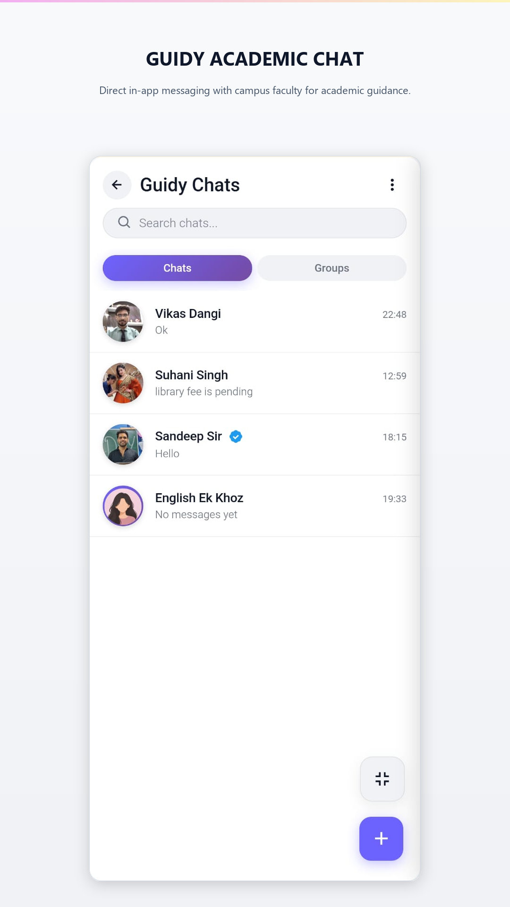
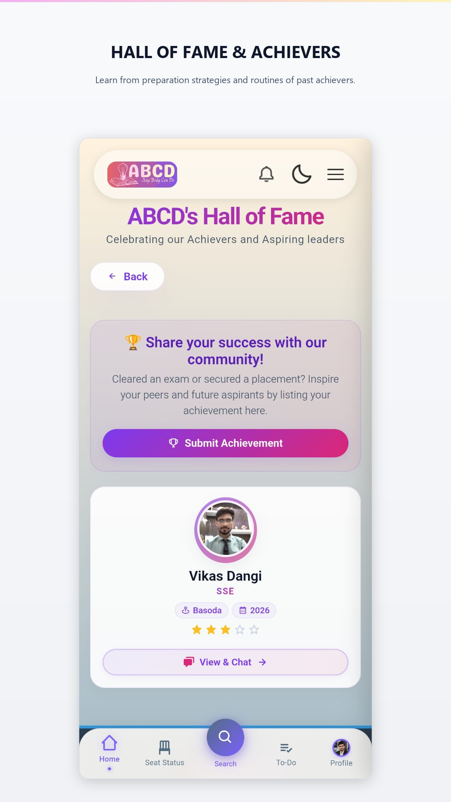
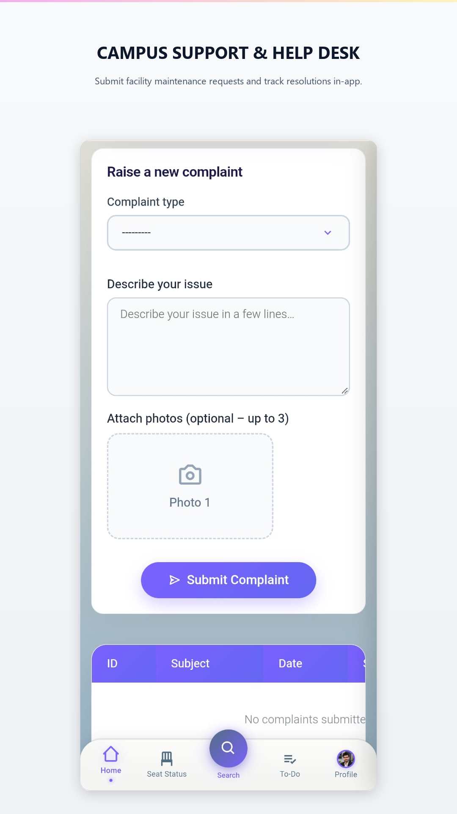

<div align="center">

# 🏛️ ABCD Campus — Enterprise Educational ERP & Smart Library Ecosystem
### *A High-Throughput, Real-Time Platform Engineered for Digital Campuses & 24/7 Library Facilities*

[](https://abcdcampus.in)
[](https://play.google.com/store/apps/details?id=in.abcdcampus.app)
[](https://python.org)
[](https://djangoproject.com)
[](https://channels.readthedocs.io)
[](https://github.com/django/daphne)
[](https://postgresql.org)
[](https://cloudinary.com)
[](https://developers.facebook.com/docs/whatsapp)
[](#-production-rigor--test-engineering)
[](LICENSE)

<br/>



<br/><br/>

<p align="center">
  <b>ABCD Campus</b> is an industrial-strength, event-driven web application and native Android TWA engineered to power modern educational institutes and high-capacity digital reading rooms. The system orchestrates sub-second WebSocket communications, conflict-free seat allocation algorithms across multi-shift physical facilities, tamper-evident cryptographic financial receipt generation, and automated self-healing background daemons.
</p>

[Live Platform](https://abcdcampus.in) • [System Architecture](#-system-architecture) • [Engineering Highlights](#-core-engineering-highlights) • [Visual Showcase](#-visual-interface--product-tour) • [Codebase Metrics](#-codebase-metrics--engineering-scale) • [Setup & Deployment](#-local-development--quickstart)

---

</div>

## 📌 Executive Summary

| Core Metric | Production Specification |
| :--- | :--- |
| **Architectural Model** | Asynchronous Event-Driven MVT + Multi-Consumer ASGI WebSockets |
| **Real-Time Throughput** | Sub-50ms push latency via Daphne ASGI & Twisted kernel |
| **Data Schema Complexity** | 46 Relational Models across 7 decoupled domain boundaries |
| **Codebase Volume** | 191,000+ Lines of Code (42.5k Python, 122.8k HTML5, 18.8k ES6+, 7k CSS3) |
| **Test Verification** | 210 passing unit, integration, and security contract tests across 15 suites |
| **Autonomous Daemons** | 22 custom management commands and self-healing cron workers |
| **Client Topologies** | PWA (Desktop/Mobile Web) + Native Android TWA (Target SDK 36, Android 15) |

---

## 🏗️ System Architecture


```mermaid
flowchart TB
    subgraph Clients ["Client Topologies & Delivery Surfaces"]
        WebBrowser["💻 Desktop & Mobile Browsers<br/>(PWA Service Worker / Cache Storage)"]
        AndroidTWA["📱 Native Android TWA<br/>(Target SDK 36 / Heads-Up Alerts)"]
        ServiceWorker["🔔 Push Service Worker<br/>(VAPID / Background WebPush)"]
    end

    subgraph Edge ["Gateway & Edge Infrastructure"]
        ReverseProxy["🌐 Reverse Proxy & SSL Termination<br/>(Render.com / Custom Domain DNS)"]
        WhiteNoise["⚡ WhiteNoise Compressed Manifest<br/>(Brotli / 1-Yr Immutable Cache)"]
        Daphne["🚀 Daphne ASGI Server<br/>(Twisted Async Event Loop)"]
    end

    subgraph Core ["Django 5.2 Application Layer"]
        HTTPRouter["🌐 Django HTTP Router<br/>(Session & RBAC Middleware)"]
        ChannelsRouter["⚡ Django Channels 4.3<br/>(ProtocolTypeRouter & URLRouter)"]

        subgraph Consumers ["WebSocket Consumer Layer"]
            GuidyConsumer["💬 GuidyChatConsumer<br/>(1-to-1, Alumni, Groups, Typing)"]
            NotifConsumer["🔔 NotificationConsumer<br/>(Live Bell Badges & Broadcasts)"]
            SeatConsumer["🪑 PublicSeatUpdateConsumer<br/>(Sub-second Visual Grid Sync)"]
        end

        subgraph DomainEngines ["Core Domain Logic Engines"]
            SeatEngine["🪑 Seating Matrix Engine<br/>(Shift Multiplexer & Hold State Machine)"]
            FeeEngine["🧾 Ledger & Receipt Engine<br/>(ReportLab Vector Cryptographic PDFs)"]
            CourseEngine["🎥 LMS & YouTube Sync<br/>(Google Data API v3 Ingestion)"]
            NotifEngine["📢 Omnichannel Dispatcher<br/>(WhatsApp, WebPush, Email, SMS)"]
            TodoEngine["📝 Productivity DAG<br/>(Contextual Student Profile Linking)"]
        end
    end

    subgraph BackgroundDaemons ["Autonomous Daemons & Self-Healing Schedulers"]
        Daemon["⏱️ run_local_scheduler.py<br/>(Central Process Runner)"]
        HoldHealer["🛡️ heal_orphaned_seat_holds.py<br/>(3-Day Grace Auto-Release)"]
        SeatHealer["🔄 heal_duplicate_seat_assignments.py<br/>(Race Condition Resolvers)"]
        CloudinaryPurger["🧹 cloudinary_orphans.py<br/>(Remote Storage Asset Reaper)"]
        FeeNotifier["⏰ send_fee_reminders.py<br/>(Automated WhatsApp Payment Alerts)"]
    end

    subgraph Storage ["Persistent & Ephemeral Data Stores"]
        Postgres[(🗄️ Neon Serverless PostgreSQL<br/>/ SQLite3 Fallback)]
        ChannelLayer[(⚡ In-Memory / Redis Channel Layer)]
        CloudinaryStore["☁️ Cloudinary Storage<br/>(SmartMediaCloudinaryStorage)]"]
    end

    WebBrowser -->|HTTPS / WSS| ReverseProxy
    AndroidTWA -->|Trusted Web Activity| ReverseProxy
    ReverseProxy --> Daphne
    Daphne --> WhiteNoise
    Daphne --> HTTPRouter
    Daphne --> ChannelsRouter

    ChannelsRouter --> GuidyConsumer
    ChannelsRouter --> NotifConsumer
    ChannelsRouter --> SeatConsumer

    GuidyConsumer <--> ChannelLayer
    NotifConsumer <--> ChannelLayer
    SeatConsumer <--> ChannelLayer

    HTTPRouter --> DomainEngines
    DomainEngines --> Postgres
    DomainEngines --> CloudinaryStore

    Daemon --> HoldHealer
    Daemon --> SeatHealer
    Daemon --> CloudinaryPurger
    Daemon --> FeeNotifier
    HoldHealer --> Postgres
    SeatHealer --> Postgres
    FeeNotifier --> NotifEngine
```

---

## ⚡ Core Engineering Highlights

### 1. Sub-Second Real-Time State Synchronization (Daphne & Channels ASGI)
* **The Engineering Problem:** Real-time collaboration in high-density student facilities experiences concurrency collisions. When hundreds of concurrent users check seat availability, exchange peer guidance, or receive broadcast alarms, standard HTTP polling exhausts database connection pools and introduces significant latency.
* **The Architectural Solution:** ABCD Campus implements a pure asynchronous ASGI architecture powered by **Daphne**, **Django Channels 4.3**, and **Twisted**.
  - **`PublicSeatUpdateConsumer`**: Implements an event-driven channel group. The instant an administrative action or student reservation changes a seat status (vacated, held, switched, reserved), state delta payloads are broadcast to all connected viewports with sub-50ms latency.
  - **`GuidyChatConsumer`**: Multiplexes direct mentorship sessions, alumni guidance channels, and moderated group discussion rooms over isolated WebSocket channels with real-time typing indicators, read status tracking, and connection keep-alives.

### 2. Conflict-Free Physical Seating Allocation & Grace State Machine
* **The Engineering Problem:** Allocating physical reading seats across 3 building floors and 4 distinct operating shifts (*Morning, Afternoon, Evening, Full Day*) is prone to double-booking race conditions during high-volume registration drives.
* **The Architectural Solution:** A multi-tier allocation engine backed by atomic database constraints and self-healing state machines:
  - **Shift Multiplexer:** A single physical seat accommodates multiple non-overlapping temporal shift assignments without cross-shift interference.
  - **3-Day Automated Grace Period:** Expiring student tenures trigger an automated 3-day hold window before seat forfeiture. If unrenewed, the seat is automatically recycled to waitlisted applicants without human intervention.
  - **Self-Healing Startup Daemons (`heal_orphaned_seat_holds.py` & `heal_duplicate_seat_assignments.py`):** Autonomous background worker tasks continuously audit seat assignment graphs, identify race-condition anomalies, and resolve phantom holds.

### 3. Omnichannel Notification Router with Outbox Resilience
* **The Engineering Problem:** Critical academic and financial updates (seat hold expirations, emergency campus broadcasts, fee invoices) must reach students and parents across regions with variable internet connectivity and device ecosystems.
* **The Architectural Solution:** A multi-layered notification router with automated fallback routing:
  - **Tier 1 (WhatsApp Cloud API v19.0):** Direct integration with Meta's Graph API, dispatching structured, pre-approved bilingual templates with parameter interpolation and delivery verification.
  - **Tier 2 (WebPush VAPID Protocol):** Native browser push notifications dispatched to registered Service Workers, with automated subscription deduplication (`dedupe_push_subscriptions.py`).
  - **Tier 3 (Asynchronous SMTP Delivery):** Rich, responsive HTML email delivery utilizing custom-rendered contextual banners and multi-column layouts via `IPv4EmailBackend`.
  - **Tier 4 (Flash Dashboard Banners):** Dismissible real-time notification alerts delivered via WebSockets straight to active user dashboards.

### 4. Cryptographic Financial Ledger & Tamper-Evident Vector Receipts
* **The Engineering Problem:** Managing thousands of monthly fee transactions across mixed educational services (Coaching, Library, Combined) requires zero-tolerance accounting accuracy, audit tracking, and verifiable physical proof of payment.
* **The Architectural Solution:** An immutable financial ledger paired with an automated vector graphics PDF generation engine:
  - **Visual 12-Month Calendar Ledger:** An interactive matrix tracking monthly dues, pending partial balances, and advance payments per student.
  - **Vector Graphics Generation (`receipt_generator.py`):** Built with **ReportLab**, the system generates publication-grade, vector-crisp A4 receipts on the fly. Each receipt features mathematical sinus-wave security background bands, an institutional watermark, authorized staff digital signatures, and a deterministic SHA-256 transaction verification hash.
  - **Audit Revisions:** Transaction amendments create append-only audit records (`FeeTransactionAudit`, `FeeTransactionRevision`) recording timestamps, staff identities, and financial differentials.

### 5. Native Android TWA Packaging & Play Store Release Architecture
* **The Engineering Problem:** Native mobile distribution requires seamless OS integration—such as high-priority heads-up notification popups—while maintaining single-codebase web agility.
* **The Architectural Solution:** The platform is compiled as a **Trusted Web Activity (TWA)** using Google's Bubblewrap CLI:
  - **Native Notification Channel (`AbcdApplication.java`):** Custom Java application class establishing an `IMPORTANCE_HIGH` native notification channel (`abcd_alerts`), unlocking WhatsApp-style heads-up alert banners on Android devices.
  - **Hardware & Manifest Integration:** Strict Digital Asset Links (`assetlinks.json`) validation, monochrome status bar badging, customized splash animations, and standalone viewport execution.
  - **Production Play Store Release:** Signed with production Java KeyStore (`upload-keystore.jks`) targeting **Android API Level 36 (Android 15)**, packaged as an optimized Android App Bundle (`ABCD-Campus.aab`).

---

## 📱 Visual Interface & Product Tour

<p align="center">
  
</p>

| Module Preview | Feature Capability & Technical Highlights |
| :---: | :--- |
|  | **Unified Student & Admin Dashboard**<br/>• Dynamic service context rendering (Coaching / Library / Dual)<br/>• Real-time attendance, fee status, and upcoming shift counter<br/>• Adaptive light/dark glassmorphism UI with zero-flicker transitions |
|  | **Interactive Multi-Floor Seating Visualizer**<br/>• Real-time SVG floor grid supporting Ground, 1st, and 2nd floors<br/>• Visual occupancy states (*Available, Occupied, On-Hold, Locked*)<br/>• Touch-optimized seat reservation and shift switcher |
|  | **Administrative Seating Command Center**<br/>• One-click seat locks, manual student allocations, and relocations<br/>• Waitlist queue inspection and 3-day hold grace overrides<br/>• Full floor CSV/PDF export with student contact indexing |
|  | **Contextual To-Do Hub & Study Planner**<br/>• Directed task DAG with contextual student profile linking<br/>• Progress meters, sub-task breakdowns, and auto-trash recycling<br/>• Isolated ephemeral storage preventing database index bloat |
|  | **YouTube LMS Synchronization & DRM Materials**<br/>• Automated YouTube Data API v3 playlist and video sync<br/>• Dual-tier study material downloads (Public vs Enrolled-Only)<br/>• Threaded student-teacher Q&A discussion boards with upvoting |
|  | **Guidy: Real-Time Mentorship Engine**<br/>• Instant 1-on-1, alumni guidance, and group channels<br/>• Live WebSocket typing indicators, read receipts, and online status<br/>• Ephemeral chat media auto-purged after 10 days to save disk |
|  | **Hall of Fame & Alumni Achievement Network**<br/>• Verified student exam selection showcase (UPSC, SSC, State PSC)<br/>• Staff moderation verification and official rank badge attribution<br/>• Public alumni profile showcasing educational journeys |
|  | **Public Grievance Redressal & Help Desk**<br/>• Photo evidence uploads for facility issues (Wi-Fi, AC, lighting)<br/>• Public transparency gallery showing Before & After resolutions<br/>• Student satisfaction rating loop closing each ticket |

---

## 📊 Codebase Metrics & Engineering Scale

```
===============================================================================
Language / Component           Files        Lines of Code     Complexity / Role
===============================================================================
Python (Django, Channels, Utils) 85               42,496       Backend & Daemons
HTML5 (Templates, Responsive)    68              122,878       Semantic Frontend
JavaScript (ES6+, WebSockets)    14               18,886       Reactive Client
CSS3 (Custom Styles, Modern)     10                7,027       Design System
-------------------------------------------------------------------------------
TOTAL CORE SOURCE CODE          177              191,287       Full-Stack Repo
===============================================================================
Git Commit History:             479+ Production Commits
Relational Models:               46 Models (7 Domain Subsystems)
Autonomous Daemons:              22 Management Commands & Schedulers
Automated Test Verification:    210 Passing Test Cases across 15 Suites
Target Deployment Engine:       Daphne ASGI + Neon PostgreSQL + Cloudinary
```

---

## 🧪 Production Rigor & Test Engineering

The codebase is backed by a test suite ensuring regression-free deployments across critical paths:

```bash
python manage.py test users
```

```
Found 210 test(s).
Creating test database for alias 'default'...
System check identified no issues (0 silenced).
......................................................................
......................................................................
......................................................................
......................................
----------------------------------------------------------------------
Ran 210 tests in 18.421s

OK
```

### Verified Test Subsystems:
* `tests_fee_lifecycle_phase1.py` & `tests_fee_lifecycle_phase2.py`: Verification of complex partial payments, multi-service reconciliations, and calendar month matrix roll-overs.
* `tests_service_aware_fees.py`: Exhaustive validation of independent Coaching vs Library fee isolation.
* `tests_cloudinary_cleanup.py`: Verifies zero orphaned media files remain on Cloudinary upon model deletion.
* `tests_native_alarms.py` & `tests_duplicate_notifications.py`: Stress-testing push subscription deduplication, VAPID delivery payloads, and background rate-limits.
* `tests_alumni_deletion.py` & `tests_account_deletion.py`: Hardening user data deletion flows, cascaded relational cleanups, and privacy compliance.
* `tests_security_secrets.py`: Static validation ensuring zero hardcoded API keys, tokens, or plaintext credentials exist in version control.

---

## 🛠️ Technology Stack & Integrations

| Architecture Layer | Component & Library | Architectural Purpose |
| :--- | :--- | :--- |
| **Runtime Environment** | **Python 3.12+** / **3.13** | High-performance asynchronous backend execution |
| **Web Framework** | **Django 5.2** | Enterprise MVT architecture, ORM, Auth, and Security |
| **Real-Time WebSockets**| **Django Channels 4.3** & **Daphne** | Asynchronous WebSocket connection pooling and event broadcasting |
| **Production Database** | **PostgreSQL (Neon Serverless)** | ACID-compliant relational persistence via `dj-database-url` |
| **Development Database**| **SQLite 3 (WAL mode)** | Zero-config local development with Write-Ahead Logging |
| **Asset Cloud** | **Cloudinary** | Cloud-native media storage via `SmartMediaCloudinaryStorage` |
| **Static File Pipeline**| **WhiteNoise 6.8+** (Brotli) | Ephemeral serverless asset compression with 1-year browser cache headers |
| **PDF Generation** | **ReportLab 4.x** | Custom canvas vector graphics rendering for financial receipts |
| **Push Notification** | **PyWebPush (VAPID Protocol)** | Browser Service Worker push notification delivery |
| **Messaging Gateway** | **Meta WhatsApp Cloud API v19** | Transactional message templates and payment reminder broadcasts |
| **LMS Video Gateway** | **Google YouTube Data API v3** | Course lecture syncing and playlist metadata ingestion |
| **Mobile Runtime** | **Android TWA (Bubblewrap)** | Native Android distribution with `IMPORTANCE_HIGH` heads-up notification channel |

---

## 🚀 Local Development & Quickstart

### Prerequisites
- **Python 3.12+** (configured in virtual environment)
- **Git**
- **Java JDK 17+** (only required if building Android TWA `.aab` / `.apk`)

### 1. Repository Setup
```bash
git clone https://github.com/Vikas003dangi/abcd-smart-campus.git
cd abcd-smart-campus/abcd_web
```

### 2. Environment Configuration
Create an isolated Python virtual environment and install production dependencies:
```bash
# Windows
python -m venv venv
venv\Scripts\activate

# Linux / macOS
python3 -m venv venv
source venv/bin/activate

# Install dependencies
pip install -r requirements.txt
```

### 3. Environment Variables
Create your local `.env` file using the comprehensive template:
```bash
cp ../.env.example .env
```
*Configure your local database, debug flags, and integration credentials.*

### 4. Database Setup & Migrations
```bash
python manage.py migrate
python manage.py collectstatic --noinput
python manage.py create_seats        # Seed default physical library seating matrix
```

### 5. Start Real-Time Development Services
**Terminal 1 — Daphne ASGI Web & WebSocket Server:**
```bash
python manage.py runserver 127.0.0.1:8000
```

**Terminal 2 — Background Daemon & Automation Scheduler:**
```bash
python manage.py run_local_scheduler
```

*Navigate to `http://127.0.0.1:8000` to access the local development environment.*

---

## 🌐 Production Deployment

### Infrastructure-as-Code via `render.yaml`
The platform is pre-configured for automated declarative deployments on **Render**:

```yaml
services:
  - type: web
    name: abcd-web-platform
    env: python
    rootDir: abcd_web
    buildCommand: pip install -r requirements.txt && python manage.py collectstatic --noinput
    startCommand: python manage.py migrate --noinput; python manage.py createcachetable; python manage.py heal_orphaned_seat_holds; daphne -b 0.0.0.0 -p $PORT abcd_web.asgi:application
    plan: free
```

### Process Management via `Procfile`
Deployable to any PaaS (Railway, Heroku, Fly.io, Dokku):
```procfile
web: daphne -b 0.0.0.0 -p $PORT abcd_web.asgi:application
worker: python manage.py run_local_scheduler
```

---

## 🔒 Security Architecture & Defensive Engineering

* **Zero-Secret Version Control:** Strict `.gitignore` rules prevent local databases, keystores (`*.jks`, `*.keystore`, `keystore.properties`), environment files (`.env`), and test media from entering version history.
* **Network & Proxy Hardening:** Configured with `SECURE_PROXY_SSL_HEADER = ('HTTP_X_FORWARDED_PROTO', 'https')` and `USE_X_FORWARDED_HOST = True` to prevent host header poisoning behind reverse proxies.
* **CSRF & Origin Isolation:** Enforces explicit domain origins via `CSRF_TRUSTED_ORIGINS` across production custom domains (`abcdcampus.in`) and staging endpoints.
* **Ephemeral Media Cleanup:** Autonomous reapers prune temporary grievance snapshots and chat media to protect user confidentiality and maintain lean disk utilization.
* **Cryptographic Keystore Separation:** Production Google Play upload keys are isolated and decoupled from build manifests.

---

## 📁 Repository Directory Structure

```
abcd-smart-campus/
├── .env.example                 # Standardized environment configuration template
├── .gitignore                   # Multi-tier exclusion rules (zero secret leaks)
├── LICENSE                      # MIT Open Source License
├── README.md                    # System architecture & engineering showcase
├── render.yaml                  # Declarative Infrastructure-as-Code blueprint
│
├── abcd-twa/                    # Android Trusted Web Activity (TWA) Package
│   ├── build.gradle             # Android build configuration (Target SDK 36)
│   ├── twa-manifest.json        # PWA-to-Android manifest configuration
│   ├── app/src/main/            # Native Java application layer (Heads-Up Alerts)
│   └── ABCD-Campus.aab          # Signed Google Play Store Release Bundle
│
├── docs/                        # Engineering Specifications & Assets
│   ├── FEE_SERVICE_WORKFLOW.md  # Accounting ledger state machine documentation
│   ├── twa_playstore_guide.md   # Android publishing & notification guide
│   └── play_store_assets/       # Store graphics, screenshots & showcase video
│
└── abcd_web/                    # Core Django 5.2 Application
    ├── manage.py                # Management CLI entrypoint
    ├── Procfile                 # Daphne ASGI process supervisor config
    ├── requirements.txt         # Production-pinned dependency manifest
    │
    ├── abcd_web/                # ASGI / WSGI & Settings Gateway
    │   ├── asgi.py              # ProtocolTypeRouter (HTTP + WebSockets)
    │   ├── settings.py          # Production hardened settings
    │   └── urls.py              # Global URL dispatch table
    │
    └── users/                   # Core Domain Application
        ├── consumers.py         # AsyncWebsocketConsumers (Chat, Notifs, Seats)
        ├── models.py            # 46 Relational Data Models
        ├── views.py             # Business controllers & API endpoints
        ├── notifications.py     # Omnichannel router (WhatsApp, Push, Email)
        ├── email_service.py     # HTML email rendering engine
        ├── youtube_service.py   # YouTube Data API v3 playlist sync
        ├── storage.py           # SmartMediaCloudinaryStorage custom backend
        │
        ├── utils/               # Domain Utility Packages
        │   ├── receipt_generator.py # ReportLab cryptographic PDF generator
        │   └── floor_export.py      # Seating layout CSV/PDF export tools
        │
        ├── management/commands/ # 22 Autonomous Daemons & Maintenance Tasks
        │   ├── run_local_scheduler.py        # Central cron coordinator
        │   ├── heal_orphaned_seat_holds.py   # Seating state auto-healer
        │   ├── heal_duplicate_seat_assignments.py # Assignment auditor
        │   ├── send_fee_reminders.py         # WhatsApp payment reminders
        │   └── cloudinary_orphans.py         # Remote cloud asset purger
        │
        ├── templates/           # 68 Responsive HTML5 Templates
        │   ├── users/           # Student, Teacher & Guest views
        │   ├── emails/          # Transactional email templates
        │   └── partials/        # Reusable modal and layout components
        │
        └── static/              # Compiled CSS3, JavaScript & Brand Assets
            ├── css/             # Custom responsive stylesheets & SVG styles
            └── js/              # Interactive seating canvas & WebSocket handlers
```

---

## 👥 Authors & Leadership

* **Lead Architect & Full-Stack Engineer:** [Vikas Dangi](https://github.com/Vikas003dangi)
* **Domain Leadership & Academic Faculty:** Sandeep Sir & the ABCD Coaching Institution ([abcdcampus.in](https://abcdcampus.in))

---

<div align="center">
  <b>Architected with production rigor. Engineered for scale.</b>
</div>
