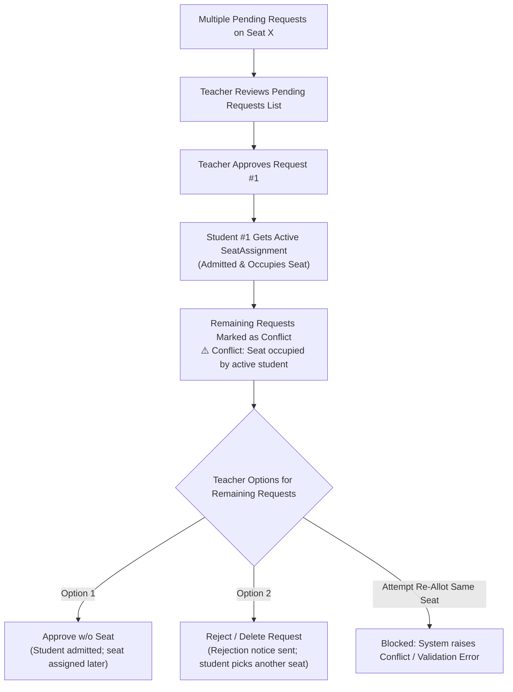
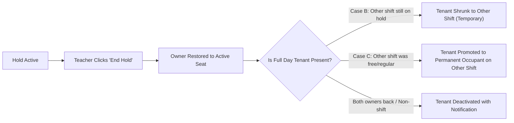

# ABCD Smart Campus — Seat Management Master Report & Reference Matrix

## 1. System Overview & Seat Categories

The ABCD Smart Campus library seat management system organizes seats into two distinct categories:

| Category | Location & Numbers | Supported Shifts | Description |
| :--- | :--- | :--- | :--- |
| **Non-Shift Seats** | **Ground Floor (1–39)** **First Floor (All Seats)** | Full Day Only (8 AM – 8 PM) | Single occupant per seat. Can be Available, On Hold, or Occupied. Supports Full Day temporary allotment during hold. |
| **Shift-Wise Seats** | **Ground Floor (40–53)** | Morning (8 AM – 2 PM) Evening (2 PM – 8 PM) Full Day (8 AM – 8 PM) | Two half-day shifts or one full day. Shifts can be independently assigned, held, temporarily allotted, or locked. |

---

## 2. Admission Form Request Matrix (What Students Can Request)

> [!NOTE]
> **Access Restriction**: Temporary allotment requests can **only** be initiated by new applicants from the **Admission Form Seat Layout**. Already-admitted students checking their seat status or requesting a seat switch cannot pick temporary allotments (they can only pick fully available seats/shifts).

| Seat State | Specific Condition | What Applicant Sees in Popup | Available Options / Buttons | Confirmation Alert & Awareness Given to Student |
| :--- | :--- | :--- | :--- | :--- |
| **Non-Shift Seat** | Available | Normal seat selection | Select Full Day Seat | Direct confirmation for regular admission. |
| **Non-Shift Seat** | On Hold (Owner on hold for $X$ days, no tenant) | "Seat is Occupied But on hold" | `Request Temporary Seat` | ⚠️ Alert: Explains $X$ days are left on hold. After hold ends, the seat returns to owner and student will not have access until a new seat is allotted. |
| **Non-Shift Seat** | Occupied (or Hold + Tenant) | "Seat is currently in use" | `Yes, Notify Me` / `Cancel` | Enrolls applicant in email notifications when the seat becomes free. |
| **Shift Seat** | Both Shifts Available | "Choose available shift" | 1. Morning (8 AM – 2 PM) 2. Evening (2 PM – 8 PM) 3. Full Day (8 AM – 8 PM) | Direct selection for chosen shift. |
| **Shift Seat: Case A1** | Morning Occupied (regular) Evening On Hold ($X$ days) | "Seat not Available — All Shifts are occupied" | `Request Temporary Seat` (Evening shift) | ⚠️ Alert: Informs that $X$ days are left on Evening hold. Access ends when hold finishes. |
| **Shift Seat: Case A2** | Morning On Hold ($X$ days) Evening Occupied (regular) | "Seat not Available — All Shifts are occupied" | `Request Temporary Seat` (Morning shift) | ⚠️ Alert: Informs that $X$ days are left on Morning hold. Access ends when hold finishes. |
| **Shift Seat: Case B** | Morning On Hold ($M$ days) Evening On Hold ($E$ days) *(Neither has tenant)* | "Only Temporary Available" | 1. `Temporary Morning` 2. `Temporary Evening` 3. `Temporary Full Day` | **For Full Day**: Informs Morning has $M$ days and Evening has $E$ days. Whichever hold ends first returns to its owner, and the student **automatically continues on the remaining shift as temporary** until both end. |
| **Shift Seat: Case C** | Morning Free / Available Evening On Hold ($E$ days) | "Choose available shift" | 1. `Morning (8 AM – 2 PM)` (Regular) 2. `Request Temporary Evening` 3. `Request Temporary Full` | **For Full Day**: Informs Morning is regular/permanent and Evening is temporary ($E$ days). When Evening hold ends, it returns to owner, and student **automatically retains Morning shift permanently**. |
| **Shift Seat: Case C (Rev)** | Morning On Hold ($M$ days) Evening Free / Available | "Choose available shift" | 1. `Evening (2 PM – 8 PM)` (Regular) 2. `Request Temporary Morning` 3. `Request Temporary Full` | **For Full Day**: Informs Evening is regular/permanent and Morning is temporary ($M$ days). When Morning hold ends, student **automatically retains Evening shift permanently**. |
| **Shift Seat: Case D** | Morning Occupied or Hold+Temp Evening On Hold ($E$ days) | "Only Temporary Available" | `Temporary Evening` | ⚠️ Alert: Informs that Evening is on hold for $E$ days. |
| **Shift Seat** | Fully Occupied (Both shifts occupied or temp-allotted) | "Seat is currently fully occupied" | `Yes, Notify Me` / `Cancel` | Enrolls applicant in email notifications when any shift becomes available. |
| **Any Seat / Shift** | Locked by Librarian | 🔒 Locked Modal | None (Selection blocked) | Alert informs that the seat/shift is locked by administration and cannot be selected. |

---

## 3. Teacher Management & Actions Matrix (Teacher Seat Status & Dashboard)

Teachers have full administrative control to allot, reassign, hold, free, and resolve conflicts from **Teacher Seat Status** and **Teacher Dashboard**.

| Seat State | Action Buttons Available in Modal | Action Behavior & Dialog | Dropdown / Shift Options Displayed |
| :--- | :--- | :--- | :--- |
| **Non-Shift: Available** | `Assign Seat` | Opens Assign Modal (Library / Coaching / Alumni / Manual Add). | Default: Full Day |
| **Non-Shift: On Hold (no tenant)** | `Allot Temp` `End Hold` `Free Seat` | `Allot Temp` assigns temporary student. `End Hold` restores owner immediately. `Free Seat` frees entire seat. | Full Day (Temporary Allotment) |
| **Non-Shift: Occupied** | `Put On Hold` `Free Seat` *(or Upcoming Hold Details)* | `Put On Hold` sets start date & duration. `Free Seat` unassigns student. | Full Day |
| **Shift: Both Available** | For Morning: `Assign` For Evening: `Assign` Bottom: `Assign Full Day` | Opens Assign modal with pre-selected shift. Teacher can switch between shifts in dropdown. | 1. Full Day (Shift Seat) 2. Morning Shift (8 AM – 2 PM) 3. Evening Shift (2 PM – 8 PM) |
| **Shift: Case A1** (Morning Occupied, Evening Hold) | Morning: `Hold`, `Free` Evening: `Temp`, `End Hold`, `Free` | Clicking `Temp` on Evening pre-selects Evening and shows remaining hold days. | Only: `Evening Shift (Temporary - Hold ends in Xd)` *(Morning is blocked)* |
| **Shift: Case A2** (Morning Hold, Evening Occupied) | Morning: `Temp`, `End Hold`, `Free` Evening: `Hold`, `Free` | Clicking `Temp` on Morning pre-selects Morning and shows remaining hold days. | Only: `Morning Shift (Temporary - Hold ends in Xd)` *(Evening is blocked)* |
| **Shift: Case B** (Both Morning & Evening on Hold) | Morning: `Temp`, `End Hold`, `Free` Evening: `Temp`, `End Hold`, `Free` Bottom: `Allot Temp Full` | Teacher can allot temporary to Morning, Evening, or Full Day. Confirmation dialog shows staggered hold durations and transition rules. | 1. `Full Day (Temporary - Morning Md & Evening Ed)` 2. `Morning Shift (Temporary - Hold ends in Md)` 3. `Evening Shift (Temporary - Hold ends in Ed)` |
| **Shift: Case C** (Morning Free, Evening on Hold) | Morning: `Assign` Evening: `Temp`, `End Hold`, `Free` Bottom: `Allot Full Day (Morning + Temp Evening)` | Teacher can allot Morning regular, Evening temp, or Full Day (Morning regular + Evening temp). | 1. `Full Day (Morning Regular + Evening Temp Ed)` 2. `Morning Shift (8 AM – 2 PM)` 3. `Evening Shift (Temporary - Hold ends in Ed)` |
| **Shift: Case C (Rev)** (Morning Hold, Evening Free) | Morning: `Temp`, `End Hold`, `Free` Evening: `Assign` Bottom: `Allot Full Day (Evening + Temp Morning)` | Teacher can allot Evening regular, Morning temp, or Full Day (Evening regular + Morning temp). | 1. `Full Day (Evening Regular + Morning Temp Md)` 2. `Morning Shift (Temporary - Hold ends in Md)` 3. `Evening Shift (2 PM – 8 PM)` |
| **Shift: Hold + Tenant Present** | `End Hold` `End Temp` | `End Hold` returns shift to owner (see Section 5 for transitions). `End Temp` frees only the temporary tenant. | Shift occupied by tenant. |
| **Shift: Any Shift Locked** | Shift shows 🔒 Lock Badge; Lock/Unlock buttons available | Locked shifts cannot be assigned or selected until unlocked by Librarian. | Locked shifts are excluded from dropdown. |

---

## 4. Multi-Request Handling & Conflict Resolution Matrix

When multiple applicants submit admission or temporary requests for the same seat/shift:

### Detailed Multi-Request Scenarios:

1. **Teacher Approves Request 1 of $N$ (Normal Admission)**:
   - **Student 1**: Status changes to `admitted`. `SeatAssignment` is activated. Email, SMS/WA, and in-app notifications are sent.
   - **Students 2 to $N$**: Remain in the pending list, but their cards immediately show:
     `⚠️ Conflict / Pending: Seat currently occupied by active student.`
   - **Action Buttons for Conflicted Requests**:
     - `Approve w/o Seat`: Admits the student into the library system without taking this occupied seat. The teacher can allot an available seat to them later from the No-Seat list.
     - `Delete Request`: Rejects the pending admission request and sends an email/notification asking the student to choose an available seat.

2. **Teacher Approves Request 1 of $N$ (Temporary Hold Request)**:
   - **Tenant 1**: Receives `SeatAssignment` with `is_partial = True, allow_hold_override = True`.
   - **Other Temporary Requesters for the same shift**: If teacher attempts to approve another tenant for that shift, the backend validates:
     `ValidationError: "<Shift> shift already has a partial tenant."`
     The teacher can reject the second request or approve without seat.

3. **Competing Requests for Full Day vs. Split Shift**:
   - Suppose Student A requested **Full Day Temporary** (Case B or C) and Student B requested **Morning Temporary**.
   - If Teacher approves Student A (Full Day): Student B's Morning request becomes conflicted.
   - If Teacher approves Student B (Morning): Morning now has a tenant. Student A's Full Day request can no longer take full day (it will show conflict, but teacher can reassign Student A to Evening temporary).

---

## 5. Automatic Transitions When Holds End

### A. When Regular Student Returns (`End Hold` executed by Teacher)

1. **Case B (Both Shifts Were On Hold, Tenant Had Full Day)**:
   - Example: Morning Hold ($7$ days) and Evening Hold ($14$ days). Tenant was assigned Full Day Temporary.
   - On Day 7, Morning Owner returns -> Teacher clicks `End Hold` for Morning Owner:
     - Morning Owner is restored to active Morning occupant.
     - Temporary Tenant **does not lose their seat**. Tenant's `SeatAssignment` automatically updates:
       `shift_type = 'evening', is_partial = True`.
     - In-App Notification:
       *"The hold on Seat 48 (Morning shift) has ended as the regular student returned. Your temporary allotment has been shifted to Evening shift until its hold ends."*
   - On Day 14, Evening Owner returns -> Teacher clicks `End Hold` for Evening Owner:
     - Evening Owner is restored.
     - Tenant's temporary assignment is deactivated.
     - In-App Notification:
       *"The hold on Seat 48 (Evening shift) has ended. Your temporary allotment is finished."*

2. **Case C (Morning Free, Evening On Hold, Tenant Had Full Day)**:
   - Tenant had Morning as regular and Evening as temporary.
   - Evening Owner returns -> Teacher clicks `End Hold` for Evening Owner:
     - Evening Owner resumes Evening shift.
     - Tenant leaves Evening shift and **automatically transitions to Morning shift as a permanent occupant**:
       `shift_type = 'morning', is_partial = False, allow_hold_override = False`.
     - In-App Notification:
       *"The hold on Seat 48 (Evening shift) has ended. You are now the permanent occupant of Morning shift on Seat 48."*

3. **Case A1 / A2 / Non-Shift (Tenant on Held Shift Only)**:
   - Owner returns -> Teacher clicks `End Hold`:
     - Tenant's assignment is deactivated.
     - In-App Notification sent informing temporary tenure is complete.

---

### B. When Hold Expires Naturally (Owner Does Not Return after 3-Day Grace Period)

Handled automatically by the daily background task (`sync_student_hold_status_daily`):
1. **Owner Release**: If today $\ge$ `hold_end_date + 3 days`, the absent owner is unassigned and moved to `pending`.
2. **Auto-Promotion of Temporary Tenant**:
   - **Single Shift Tenant**: Tenant's `is_partial` flag is set to `False`. The tenant is promoted to the **permanent occupant** of that shift.
   - **Full Day Tenant in Case B**:
     - If the other shift's hold is still active: Tenant retains Full Day access with permanent rights on the expired shift.
     - If both holds have expired without owners returning: Tenant is promoted to **permanent Full Day occupant** (`is_partial = False`).
   - **Full Day Tenant in Case C**:
     - Tenant was already regular on the free shift. With the hold expiring, the tenant is promoted to **permanent Full Day occupant**.

---

## 6. Notification & Communication Architecture

| Event | Recipient | Channels | Message Content |
| :--- | :--- | :--- | :--- |
| **Temporary Request Submitted** | Student | In-App, Email | Confirmation that temporary request on Seat $X$ (Shift) was sent to teacher for review. |
| **Temporary Request Submitted** | Teachers / Staff | In-App, Email | Alert informing that applicant submitted a special temporary seat request. |
| **Temporary Request Approved** | Student | In-App, Email, WhatsApp | Welcome message with seat number, shift, and hold tenure end date. |
| **Temporary Shift Updated (Case B)** | Student | In-App | Notice that owner returned on Shift 1, and student is now shifted to Shift 2 temporary. |
| **Permanent Shift Allotment (Case C)** | Student | In-App | Notice that hold on held shift ended, and student is now permanent occupant of the regular shift. |
| **Temporary Allotment Ended** | Student | In-App, Email | Notice that hold has concluded and temporary access has ended. |
| **Seat Interest ("Notify Me") Alert** | Interested Students | Email | Instant notification when a previously occupied seat becomes available. |
| **Hold 3-Day Grace Started** | Absent Owner & Teachers | In-App, Email, WhatsApp | Urgent notice that hold reached end date; 3-day grace period started before seat release. |
| **Auto-Promotion to Permanent** | Temporary Student | In-App, Email | Congratulations notification confirming promotion from temporary tenant to permanent occupant. |

---

## 7. Summary of Code Improvements Made

1. **`teacher-seat-manager.js`**:
   - Replaced flawed availability check with `setupAssignShiftSelect` which includes hold shifts as selectable temporary options and preselects the clicked shift.
   - Added `Allot Temp Full` button for Case B and `Allot Full Day` button for Case C in the seat details modal.
   - Removed destructive CSS-query-based disabling logic in `actionAssignStudent`.
   - Added informative confirmation subtexts explaining hold durations and transitions.
2. **`admission-seat-selector.js`**:
   - Updated `showConfirmationAlert` for Case 4 (Case C) to clearly explain that requesting Full Day grants regular rights on the available shift and temporary rights on the held shift.
   - Updated Case 6 (Case B) to clearly explain staggered shift expirations for Full Day requests.
3. **`views.py` (`seat_action_api`)**:
   - Implemented intelligent shift downgrade / promotion in `end_hold` so Full Day temporary tenants are not erroneously ejected when only one owner returns.
   - Implemented shift-aware tenant handling in `free_shift`.
4. **`utils.py` (`sync_student_hold_status_daily`)**:
   - Updated Stage 3 auto-promotion logic to support full-day temporary tenants across both single and dual hold expirations.
