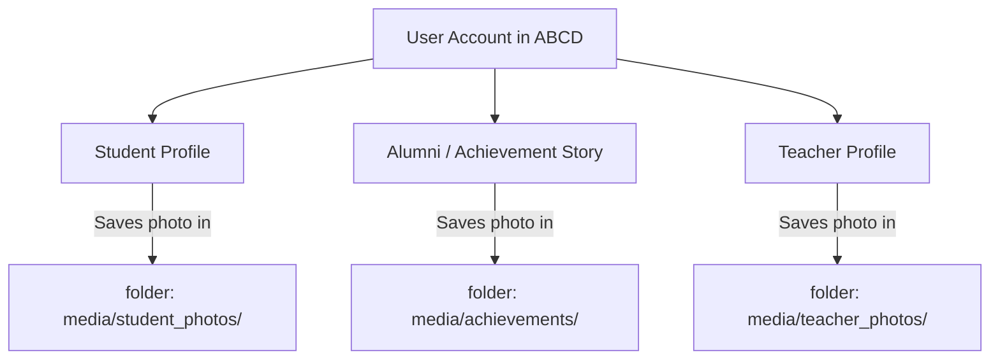
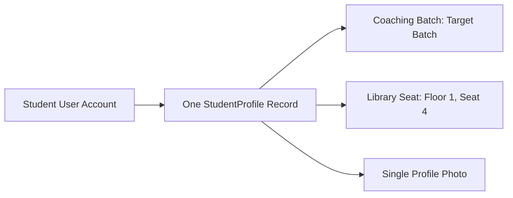
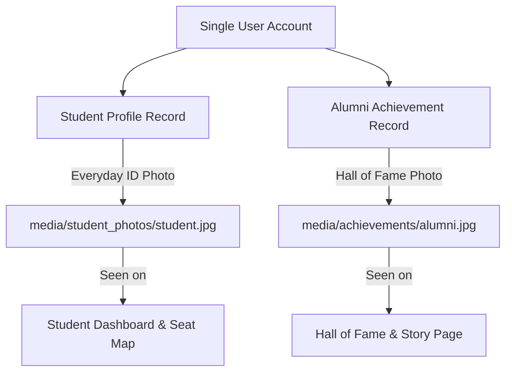
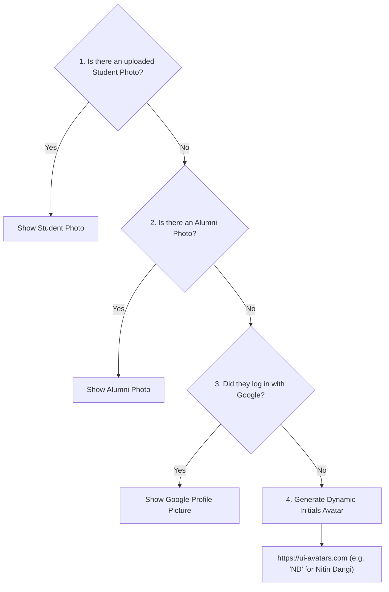

# ABCD Smart Campus — Complete Profile Photo System Guide

Welcome to the complete guide on how **Profile Photos** work across the entire ABCD Coaching & Library platform. 

This guide is written in clear, simple English with step-by-step explanations, diagrams, and tables so you can easily understand every workflow, rule, and feature.

---

## 1. Quick Overview: The Big Picture

In ABCD, different people use the platform:
- **Students** (Coaching, Library, or both)
- **Achievers / Alumni** (Students who got selected for jobs and appear in the Hall of Fame)
- **Teachers / Admin** (Faculty and staff managing the institute)

To make sure photos look great, load quickly, and never show a broken link, the system has:
1. **A smart circular photo cropper** (`ABCDImageCropper`) so photos are always centered and sharp.
2. **Dedicated folders** so student photos and hall-of-fame photos do not mix up.
3. **An automatic backup/fallback system**: if a photo is missing, the system automatically borrows another available photo or creates an avatar with the person's initials.
4. **Instant update feature (Cache-Buster)**: whenever someone changes their photo, everyone sees the new photo immediately without needing to refresh their browser.

---

## 2. Where Photos are Stored in the Database

There are 3 main profile photo storage areas:

| Profile Type | Where the Photo File Lives | What It Is Used For |
| :--- | :--- | :--- |
| **Student Photo** | `media/student_photos/` | Used on Student Dashboard, Teacher Student Details, Library Seat Map, Fee Calendar & Receipts, Attendance, and Guidy Chat. |
| **Alumni Photo** | `media/achievements/` | Used on the **Hall of Fame** cards, Achiever Detail Story page, and Alumni Dashboard. |
| **Teacher Photo** | `media/teacher_photos/` | Used for faculty profiles and teacher chats in Guidy. |

---

## 3. All the Ways & Places to Upload or Change a Photo

Here is a complete list of every place where a photo can be uploaded, edited, or deleted in ABCD:

### Way 1: When a Student Fills the Admission Form
- **Where:** On the **Admission Page** (`/admission-form/`).
- **Who does it:** The student (or parent) applying for Coaching or Library.
- **How it works:** 
  1. The student chooses their image.
  2. The circular cropper popup opens automatically.
  3. The student zooms, pans, rotates, and confirms the circle crop.
  4. The photo is saved as their official `StudentProfile` photo.

---

### Way 2: Student Changing Photo from "My Details"
- **Where:** Inside the Student Dashboard $\rightarrow$ **My Details** page (`/my-details/`).
- **Who does it:** The student.
- **How it works:**
  1. The student clicks on their profile picture frame or the camera icon.
  2. A **Photo Manager Modal** pops up with 3 choices:
     - **Upload New Photo:** Pick a new image from phone/computer $\rightarrow$ cropper opens $\rightarrow$ saves.
     - **Adjust Current Photo:** Re-opens the *current photo* inside the cropper so they can adjust the zoom or framing without looking for the original file!
     - **Remove Photo:** Deletes the photo completely and resets to the default avatar.

---

### Way 3: Teacher Updating Any Student's Photo
- **Where:** In Teacher Dashboard $\rightarrow$ Click student $\rightarrow$ **Student Details** page (`/teacher/student/<id>/`).
- **Who does it:** Teacher / Admin.
- **How it works:**
  - The teacher has the exact same **Photo Manager Modal** as the student.
  - The teacher can upload, crop, adjust, or delete the student's photo at any time (for example, if an offline student brought a passport-size photo).

---

### Way 4: Teacher Assigning a Library Seat Directly (Manual Admission)
- **Where:** In Teacher Dashboard $\rightarrow$ **Seat Manager Grid**.
- **Who does it:** Teacher / Staff.
- **How it works:**
  - When clicking on an empty seat and filling the manual admission popup, the teacher can attach a photo.
  - The system crops it and directly saves it as that student's profile photo.

---

### Way 5: Submitting an Alumni Story (Hall of Fame)
- **Where:** On the **Share Your Success Form** (`/achievements/add/`).
- **Who does it:** A selected student or alumnus.
- **How it works:**
  - The student fills out their job post, selection year, and experience.
  - They upload their formal / uniform selection photo.
  - The cropper modal shapes it into a circle.
  - It saves under `media/achievements/`. Once approved by the teacher, it appears in the **Hall of Fame**.

---

### Way 6: Editing an Alumni Profile
- **Where:** Inside Alumni Dashboard $\rightarrow$ **Edit Profile** (`/alumni/edit/`).
- **Who does it:** The alumnus (or Teacher from admin panel).
- **How it works:**
  - They can replace their Hall of Fame photo with a new one at any time.

---

## 4. How Multi-Service Students Work (Coaching + Library)

A very common question: **"What happens when a student takes BOTH Coaching and Library?"**

> [!NOTE]
> In ABCD, a student only has **ONE login account** and **ONE student profile**, even if they are enrolled in both Coaching and Library!

### What happens when they add a second service?
1. Suppose a student first joins **Coaching** and uploads a photo.
2. Later, they fill out the admission form to book a **Library Seat**.
3. In the admission form:
   - The form detects they are already a coaching student.
   - It shows their **existing photo preview**.
   - **If they do not upload a new photo:** The system automatically keeps their existing coaching photo.
   - **If they upload a new photo:** It updates their photo across both Coaching and Library.
4. **Single Source of Truth:**
   - In the Coaching attendance list $\rightarrow$ shows their photo.
   - On the Library seat map $\rightarrow$ shows the exact same photo.
   - If they change their photo tomorrow in "My Details", it updates in **both** Coaching and Library instantly.

---

## 5. Users Who Are BOTH Student and Alumni

What happens when an active or past student gets selected for a government job and becomes an **Alumnus** in the Hall of Fame?

They now have **two special records** linked to their single login:

### Can they have two different photos?
**Yes!**
- Their **Alumni Photo** can be their formal uniform photo (e.g., Police Sub-Inspector uniform or bank officer dress) shown in the Hall of Fame.
- Their **Student Photo** can be their regular casual photo shown on their student dashboard.

### Where does each photo show up?
| Screen / Feature | Which Photo Is Displayed? |
| :--- | :--- |
| **Hall of Fame Cards** | Displays the **Alumni Photo**. *(If missing, it automatically borrows their Student Photo).* |
| **Achiever Story Detail Page** | Displays the **Alumni Photo**. |
| **Student Dashboard & Fees** | Displays the **Student Photo**. *(If missing, it automatically borrows their Alumni Photo).* |
| **Guidy Chat & Top Navigation Bar** | Checks **Student Photo first**, then **Alumni Photo**. |

---

## 6. The Automatic Fallback System (Zero Broken Images)

What happens if someone never uploaded a photo, or deleted it? The system follows a strict **5-step priority ladder**:

> [!TIP]
> Thanks to Step 4, even if a user has no photo and didn't use Google, they will see a stylish colored circular avatar with their exact initials (e.g., **"SR"** for *Suhani Raghuwanshi*). No broken image icons ever!

---

## 7. The Image Cropper Tool (`ABCDImageCropper`)

Whenever a user selects an image from their phone or computer, the platform opens the **ABCD Image Cropper Modal**:

1. **Circular Preview:** Shows a circular mask so the user can see exactly how their face fits inside the circle.
2. **Aspect Ratio Locked:** Locked to 1:1 square ratio, preventing stretched or squished faces.
3. **Zoom & Pan:** The user can zoom in/out with the mouse wheel or touch-pinch on mobile, and drag the image into place.
4. **Rotation:** 90-degree rotate buttons to fix sideways phone photos.
5. **High Resolution Output:** Generates a crisp $600 \times 600\text{ px}$ image.
6. **File Size Protection:** Automatically checks file size (maximum 2MB for stories, 5MB for admissions).

---

## 8. Why Photos Update Instantly (The Cache-Buster Trick)

Normally, web browsers remember (cache) images. When you change a photo, the browser often keeps showing the old photo until you press `Ctrl + F5`.

**How ABCD solved this:**
Every time a photo is saved, the server looks at the file's last modified timestamp and appends it to the URL:
$$\text{URL: } \texttt{/media/student_photos/john.jpg?v=1789716884}$$

When the student crops or updates their photo, the timestamp changes:
$$\text{New URL: } \texttt{/media/student_photos/john.jpg?v=1789729901}$$

The browser sees a new version number and **immediately downloads the fresh photo without needing a hard refresh**.

---

## 9. Clean Storage Management (No Wasted Space)

Whenever someone replaces or deletes a photo:
1. The old image file is **permanently deleted** from the hard drive (`student.photo.delete(save=False)`).
2. The new image takes its place.
3. If a student account is deleted, all their photos in `media/` are cleaned up automatically.
4. This keeps the server fast, light, and free of junk files.

---

## 10. Summary Cheat Sheet

| Question | Answer in Simple Words |
| :--- | :--- |
| **Can a student change their own photo?** | Yes, anytime by visiting **My Details** (`/my-details/`) and clicking on their picture. |
| **Can a teacher change a student's photo?** | Yes, from the **Student Details** page in Teacher Dashboard. |
| **What happens to coaching students joining library?** | Their existing photo is automatically kept for the library too. |
| **What if a student is also an achiever in Hall of Fame?** | They have two photos: their Hall of Fame photo for their story, and their student photo for daily classes. If one is missing, it borrows the other! |
| **What if a user has no photo at all?** | It shows their Google picture if available, or automatically generates a clean circular badge with their name initials. |
| **Are photos distorted or blurry?** | No, the built-in circular cropper formats every photo to a sharp $600 \times 600$ circle before saving. |
